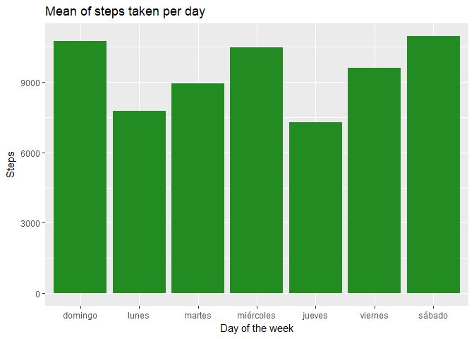

---
title: "Reproducible Research: Peer Assessment 1"
output: 
  html_document:
    keep_md: true
--- 


## Loading and preprocessing the data


```r
library(tidyverse)
```

```
## -- Attaching packages ------------------------------------------------------ tidyverse 1.2.1 --
```

```
## v ggplot2 2.2.1     v purrr   0.2.4
## v tibble  1.3.4     v dplyr   0.7.4
## v tidyr   0.7.2     v stringr 1.2.0
## v readr   1.1.1     v forcats 0.2.0
```

```
## -- Conflicts --------------------------------------------------------- tidyverse_conflicts() --
## x dplyr::filter() masks stats::filter()
## x dplyr::lag()    masks stats::lag()
```

```r
library(knitr)
library(lubridate)
```

```
## 
## Attaching package: 'lubridate'
```

```
## The following object is masked from 'package:base':
## 
##     date
```

```r
knitr::opts_chunk$set(echo = TRUE, cache = TRUE)
```

```r
# read_csv can read zip files
data_raw <- read_csv("activity.zip")
```

```
## Parsed with column specification:
## cols(
##   steps = col_integer(),
##   date = col_date(format = ""),
##   interval = col_integer()
## )
```

## What is mean total number of steps taken per day?


```r
steps_day_mean <- data_raw %>% 
  count(date, wt = steps) %>%
  mutate(day = wday(date, label = TRUE, abbr = F)) %>% 
  group_by(day) %>% summarise(mean_day = mean(n, na.rm = TRUE))
# plot
ggplot(steps_day_mean, aes(day, mean_day)) +
  geom_bar(stat = "identity", fill = "forestgreen") +
  labs(x = "Day of the week", y = "Steps", 
       title = "Mean of steps taken per day")
```

<!-- -->


## What is the average daily activity pattern?


## Imputing missing values


## Are there differences in activity patterns between weekdays and weekends?
