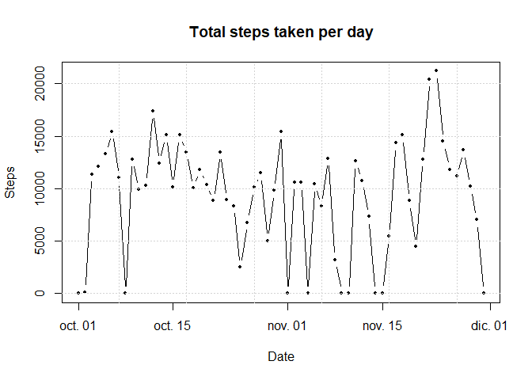
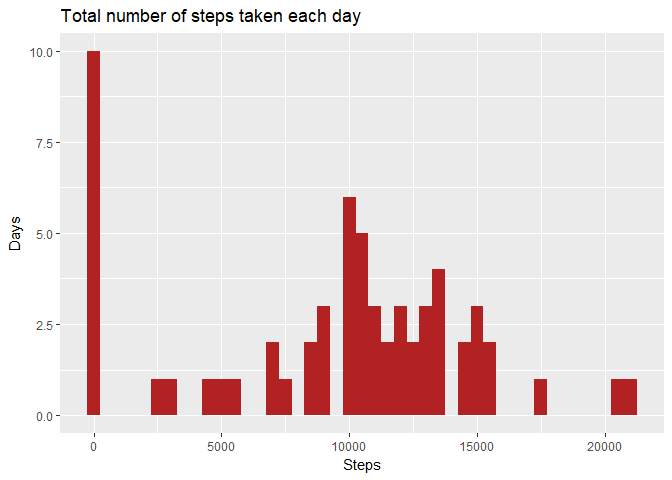
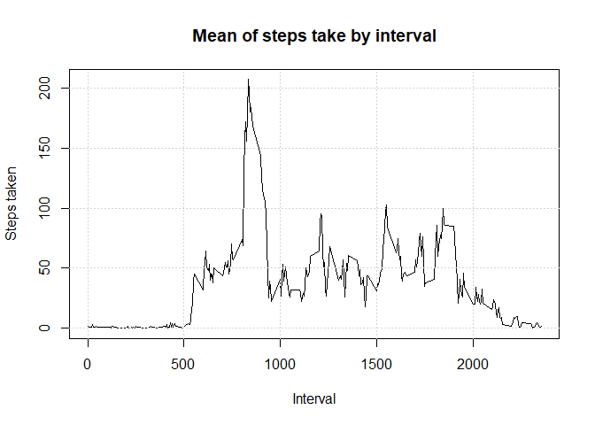
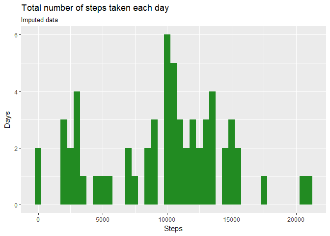
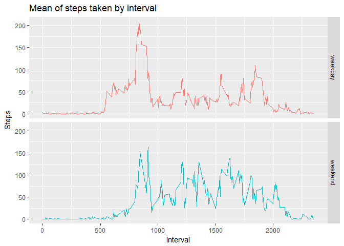

---
title: "Reproducible Research: Peer Assessment 1"
output: 
  html_document:
    keep_md: true
--- 

### Settings and loading the data


```r
# load used packages
library(magrittr)
library(tidyverse)
library(knitr)     
library(lubridate) 
# shown code, and cache results the default
knitr::opts_chunk$set(echo = TRUE, cache = TRUE)
```

```r
# readr::read_csv can read zip files     
steps_raw <- read_csv("activity.zip") %>% as.tibble()
```

### What is mean total number of steps taken per day?

The data contains missing values, I will ignore them for the moment.


```r
# total steps per day
steps_date <- steps_raw %>% group_by(date) %>% summarise(steps = sum(steps, na.rm = TRUE))
```

```r
plot(steps_date, type = "b", pch = 19, cex = .5, ann = FALSE)
title(xlab = "Date", ylab = "Steps", main = "Total steps taken per day")
grid()
```

<!-- -->

The next histogram shows the total number of steps taken each day.


```r
ggplot(steps_date, aes(steps)) + geom_histogram(binwidth = 500, fill = "firebrick") + 
  labs(x = "Steps", y = "Days", title = "Total number of steps taken each day")
```

<!-- -->

#### Mean and median of the total number of steps taken each day

The mean of steps taken each day is 9354.23, and the median is 10395


### What is the average daily activity pattern?


```r
steps_interval <- steps_raw %>% 
  group_by(interval) %>% summarise(steps = mean(steps, na.rm = TRUE))
# most active interval
top_interval <- steps_interval %>% arrange(desc(steps)) %>% head(1)
```

```r
steps_interval %>% plot(type = "l", ann = FALSE)
title(xlab = "Interval", ylab = "Steps taken", main = "Mean of steps take by interval")
grid()
```

<!-- -->


#### Most active interval
The interval 835 contains the maximum, on average, number of steps, 206.17 steps.


### Imputing missing values

#### Missing values in the dataset

The only column with missing values is steps.


```r
number_na <- steps_raw %>% filter(is.na(steps)) %>% nrow
number_na
```

```
## [1] 2304
```


There are 2304 missing values in the dataset.  


#### Devise a strategy for filling in all of the missing values

I will use the median for the 5-minute interval of the same weekday across the whole period to impute missing values.


#### Create a new dataset that is equal to the original dataset but with the missing data filled in.


```r
# imputed values
steps_median <- steps_raw %>% 
  mutate(day = wday(date, label = TRUE, abbr = FALSE)) %>% group_by(interval, day) %>%
  summarise(steps_median = median(steps, na.rm = TRUE)) %>% ungroup()
# replace missing values
steps_imputed <- steps_raw %>% mutate(day = wday(date, label = TRUE, abbr = FALSE)) %>% 
  left_join(steps_median) %>% mutate(steps = ifelse(is.na(steps), steps_median, steps)) %>% 
  select(-day, -steps_median)
```

```
## Joining, by = c("interval", "day")
```

#### Histogram of the total number of steps taken each day


```r
# aggregate steps by day
steps_imputed_day <- steps_imputed %>%   
  count(date, wt = steps)
# viz
steps_imputed_day %>%
  ggplot(aes(n)) + geom_histogram(binwidth = 500, fill = "forestgreen") +
  labs(x = "Steps", y = "Days", title = "Total number of steps taken each day",
       subtitle = "Imputed data")
```

<!-- -->

#### Calculate and report the mean and median total number of steps taken per day

The mean of the steps taken per day of the imputed data is 9705.24, 
and the median is 1.0395\times 10^{4}.  

The median of the imputed data is the same than the original, but the mean increased from 
9354.23 to 9705.24.  

The imputation has no effect in the median, but increased the mean.  


### Are there differences in activity patterns between weekdays and weekends?

#### Create a new factor variable in the dataset with two levels – “weekday” and “weekend”


```r
steps_imputed_enriched <- steps_imputed %>% 
  mutate(day     = wday(date, label = TRUE, abbr = FALSE)) %>% 
  mutate(weekend = ifelse(day %in% c("sábado", "domingo"), "weekend", "weekday")) %>%   
  select(-day)
```

#### Make a panel plot containing a time series plot (i.e. type = "l") of the 5-minute interval (x-axis) and the average number of steps taken, averaged across all weekday days or weekend days (y-axis). See the README file in the GitHub repository to see an example of what this plot should look like using simulated data.


```r
# aggregation
steps_imputed_weekday <- steps_imputed_enriched %>%  
  group_by(interval, weekend) %>% 
  summarise(steps = mean(steps, na.rm = TRUE) %>% ceiling())
```

```r
# viz  
steps_imputed_weekday %>% 
  ggplot(aes(interval, steps, color = weekend)) +
  geom_line() + facet_grid(weekend ~ .) +
  theme(legend.position = "none") +
  labs(x = "Interval", y = "Steps", title = "Mean of steps taken by interval")
```

<!-- -->

